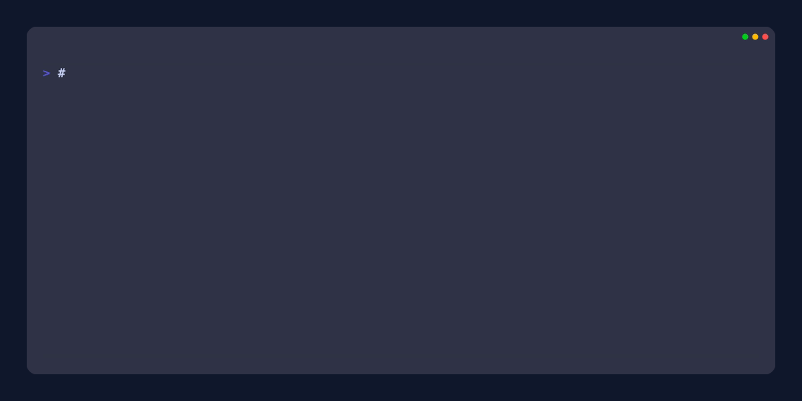

# ⚡ gh-aca-utils — GitHub CLI Extension from the ACA Team

[](https://golang.org/)
[](LICENSE)
[](https://github.com/greenstevester/gh-aca-utils/releases)
[](https://goreportcard.com/report/github.com/greenstevester/gh-aca-utils)
[](https://github.com/greenstevester/gh-aca-utils/actions)

A GitHub CLI extension for automating common ACA tasks across repositories.

## What is this?

It's a GitHub Command Line (gh cli) extension that provides two essential commands for managing tech-stack configurations:

- **`ip-port`** - Scans repositories to extract IP addresses and port configurations from config files
- **`flip-adapters`** - Toggles adapter settings (0↔1) in environment parameter files with optional Git workflow automation

Perfect for DevOps teams managing multiple microservices with environment-specific configurations.



## 🚀 Quick Start

## Prerequisites - you must have these already installed:

- GitHub CLI v2.0.0+ ([installation guide](https://github.com/cli/cli#installation))
- Git authentication configured (`gh auth status`)
- Access to target repositories

## Installation

1. Install the `gh` cli - see the [installation](https://github.com/cli/cli#installation)

   _Installation requires a minimum version (2.0.0) of the GitHub CLI that supports extensions._

2. Install this extension:

   ```sh
   gh extension install greenstevester/gh-aca-utils
   ```

<details>
   <summary><strong>Manual Installation</strong></summary>

> If you want to install this extension manually, follow these steps:

1. clone the repo

   ```sh
   # git
   git clone https://github.com/greenstevester/gh-aca-utils

   # GitHub CLI
   gh repo clone greenstevester/gh-aca-utils
   ```

2. `cd` into it

   ```sh
   cd gh-aca-utils
   ```

3. add dependencies and build it

   ```sh
   go get && go build
   ```

4. install it locally
   ```sh
   gh extension install .
   ```
   </details>

## How to use it ( a few examples )

```bash
# Show available commands
gh aca --help

# Get help for specific commands
gh aca ip-port --help
gh aca flip-adapters --help
```

### IP/Port Extraction Command

Extract IP addresses and port configurations from repository files:

```bash
# Scan a public repository for IP/port configurations
gh aca ip-port --repo octocat/Hello-World --output table

# Scan with custom file patterns
gh aca ip-port --repo myorg/microservice \
  --include "**/*.properties,**/*.yml,**/*.json" \
  --exclude "**/test/**,**/node_modules/**" \
  --output json

# Scan specific branch or tag
gh aca ip-port --repo myorg/api-service --ref production --output csv
```

**Supported file types**: `.properties`, `.yml`, `.yaml`, `.conf`, `.ini`, `.txt`, `.env`, `.json`

**Output formats**:
- `csv` (default) - Comma-separated values for spreadsheet import
- `table` - Human-readable formatted table
- `json` - Machine-readable JSON array

#### Example Output

```bash
$ gh aca ip-port --repo myorg/config-repo --output table

IP Key          IP Value      Port Key       Port Value  File Path                    Line
database.host   10.0.0.5      database.port  5432        config/app.properties        12
redis.host      172.16.0.10   redis.port     6379        config/cache.yml            8
api.host        192.168.1.100 api.port       8080        env/prod/service.properties  15
```

### Adapter Toggle Command

Toggle adapter configurations in environment parameter files:

```bash
# Dry run (default) - show what would change
gh aca flip-adapters --repo myorg/service \
  --env dev \
  --adapters billing,payment,notifications

# Apply changes and create commit + PR
gh aca flip-adapters --repo myorg/service \
  --env production \
  --adapters search,analytics \
  --commit \
  --pr \
  --branch "toggle/prod-adapters"

# Apply changes only (no commit)
gh aca flip-adapters --repo myorg/service \
  --env staging \
  --adapters crm,inventory \
  --dry-run=false
```

**Required flags**:
- `--repo` - Target repository (format: `owner/repo`)  
- `--env` - Environment directory under `env/` (e.g., `dev`, `staging`, `production`)
- `--adapters` - Comma-separated list of adapter keys to toggle

**Optional flags**:
- `--commit` - Create commit and push to new branch
- `--pr` - Create pull request (implies `--commit`)  
- `--branch` - Custom branch name (default: `toggle/adapters-{env}`)
- `--dry-run` - Show changes without applying (default: `true`)
- `--output` - Output format: `table` (default) or `json`

#### Example Output

```bash
$ gh aca flip-adapters --repo myorg/api --env dev --adapters billing,search --output table

Adapter  Old  New  File
billing  0    1    env/dev/parameters.properties
search   1    0    env/dev/parameters.properties
```

### Expected File Structure in your repository for this feature to work

For the `flip-adapters` command, your repository should have this structure:

```
your-repo/
├── env/
│   ├── dev/
│   │   └── parameters.properties
│   ├── staging/
│   │   └── parameters.properties
│   └── production/
│       └── parameters.properties
```

Where `parameters.properties` contains adapter configurations:
```properties
# Adapter configurations
billing.adapter=0
search.adapter=1  
payment.adapter=1
crm.adapter=0
```

## Troubleshooting

### Authentication Issues
```bash
# Check GitHub CLI authentication
gh auth status

# Re-authenticate if needed
gh auth login
```

### Repository Access
```bash
# Verify you can access the repository
gh repo view owner/repo

# For private repos, ensure you have read access
gh repo clone owner/repo --depth=1
```

### Common Errors

**Error: `repo ORG/REPO is required`**
- Solution: Always specify the `--repo` flag with format `owner/repository`

**Error: `env is required`**  
- Solution: Specify the environment directory with `--env` (e.g., `--env dev`)

**Error: `adapter "xyz" not found`**
- Solution: Check the adapter name exists in your `env/{ENV}/parameters.properties` file

**Error: `failed to execute command: timeout`**
- Solution: Large repositories may timeout. Try scanning specific branches with `--ref`

## Advanced Examples

### Batch Processing Multiple Repos

```bash
# Create script to scan multiple repositories
#!/bin/bash
repos=("org/api-service" "org/web-app" "org/database")

for repo in "${repos[@]}"; do
  echo "Scanning $repo..."
  gh aca ip-port --repo "$repo" --output csv >> all-configs.csv
done
```

### Integration with CI/CD

```yaml
# GitHub Actions workflow example
- name: Toggle staging adapters
  run: |
    gh aca flip-adapters \
      --repo ${{ github.repository }} \
      --env staging \
      --adapters ${{ inputs.adapters }} \
      --commit \
      --pr
```

## Upgrade

```bash
gh extension upgrade aca
```
